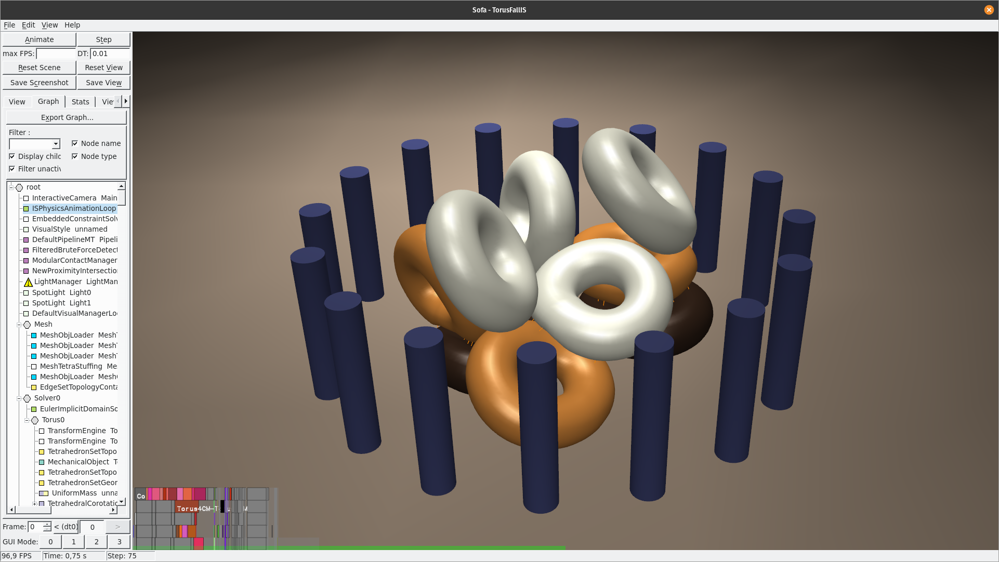
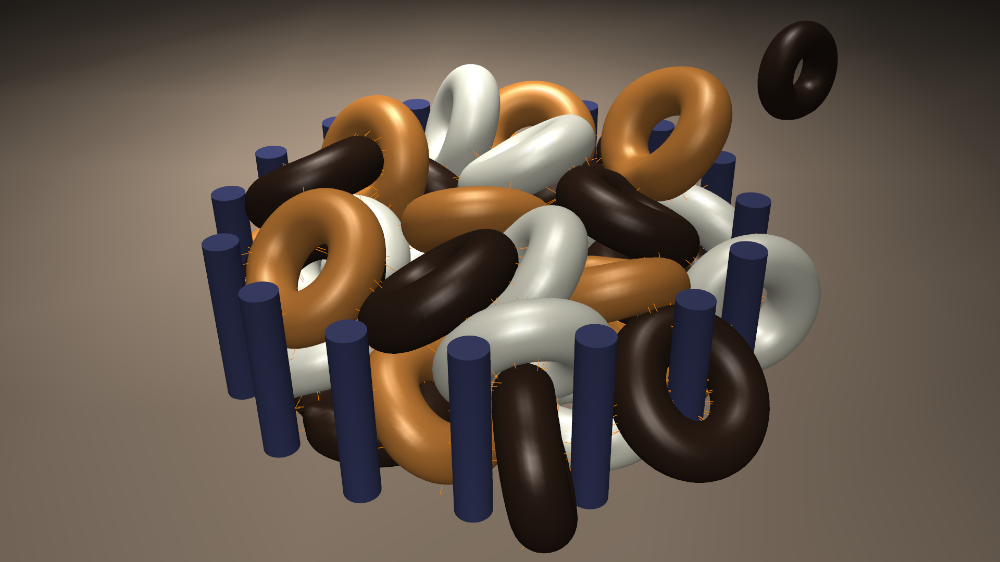
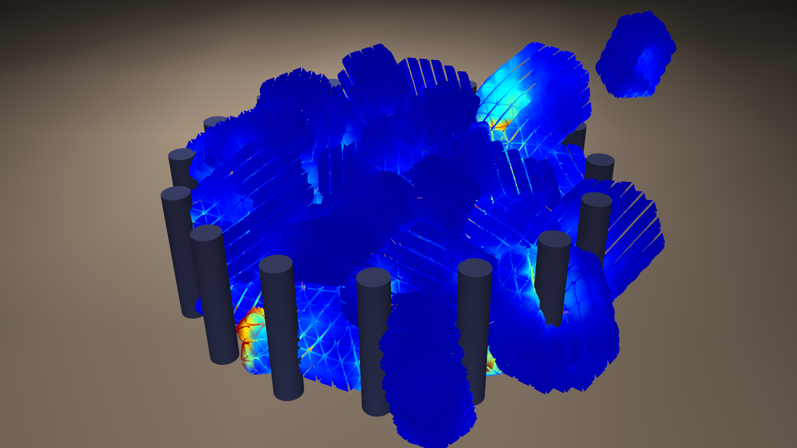

**This repository contains a technology demonstration project from [InSimo](https://www.insimo.com), based on [ISSofa](https://github.com/InSimo/ISSofa), a version of [SOFA](https://www.sofa-framework.org/) that is optimized for the use case of interactive biomechanical simulations.**

[](doc/images/TorusFall_10x129_DOF.png)

It also contains:
- [ISSofaGUI](https://github.com/InSimo/ISSofaGUI): a modified version of the GUI originally provided in Sofa's application/sofa/gui directory
- [ISSofaPython](https://github.com/InSimo/ISSofaPython): a pybind11-based python binding module and plugin compatible with both python 2 and python 3
- [ISExternals](https://github.com/InSimo/ISExternals) and [SofaWinDependencies](https://github.com/InSimo/SofaWinDependencies): precompiled dependencies (currently only for Windows and Linux)

## Build Instructions

The project main `CMakeLists.txt file` is located in the `build` folder.
See [the following document](https://docs.google.com/document/d/1lpQx7Yv4o2v18lNtOjqOFATQ0IemkY_Fh5XnJN6pL30/edit?usp=sharing) for more detailed instructions.

## Execution Instructions

Use `runSofa` from the cmake build directory.

`ISSofaPythonPlugin` needs to be loaded to run python scenes.
A `sofa.env` file is generated at cmake time that should do it automatically, but if it fails you can load it via the GUI or the `-l ISSofaPythonPlugin` command line argument.

## Packaging Instructions

Sources archives (one per submodule):
```bash
OUTPUT="ISSofaDemo-$(date +%F)"
git archive -9 -o "${OUTPUT}.zip" --prefix="${OUTPUT}/" HEAD
git -C IS/ISExternals archive -9 -o "${PWD}/${OUTPUT}_ISExternals.zip" --prefix="${OUTPUT}/IS/ISExternals/" HEAD
git -C IS/SofaWinDependencies archive -9 -o "${PWD}/${OUTPUT}_SofaWinDependencies.zip" --prefix="${OUTPUT}/IS/SofaWinDependencies/" HEAD
```

Or with [git-archive-all](https://github.com/Kentzo/git-archive-all):
```bash
pip install git-archive-all
git archive-all -9 -o "ISSofaDemo-$(date +%F).zip" --prefix="ISSofaDemo-$(date +%F)/" HEAD
```

Or to create a 7z archive
```bash
OUTPUT="ISSofaDemo-$(date +%F)"
mkdir "${OUTPUT}" && git archive HEAD | tar xC "${OUTPUT}" && git submodule foreach "git archive --prefix=\"\$sm_path/\" \$sha1 | tar xC \"${PWD}/${OUTPUT}\"" && 7z a "${OUTPUT}.7z" "${OUTPUT}" && rm -rf "${OUTPUT}"
```

### Configuring the build

The build configuration can be specified by editing the `build/ProjectConfiguration.cmake` file

# Demonstrations

**Note:** currently we provide versions using python or xml(+php). Ideally, once the python support has stabilized in Sofa, a single (python-based) version would replace the others.

Within the examples folder:
## TorusFall
The main multithreading demonstration / benchmark scene.

It requires the ISSofaPythonPlugin plugin to be loaded.

Parameters can be edited at the top of the file, or 
using environment variables (to run multiple benchmarks for example).

**Videos:**

[](https://isdata.insimo.com/s/GCrjzFAcDxbepcK)
[](https://isdata.insimo.com/s/xPS4xZHpM7foqL8)


### TorusFallSofaPublic
This version should work with the public Sofa version (tested with v20.06.01).

**Note that a [patch for BarycentricMapping](examples/patch-BarycentricMapping-useRestPosition-v20.06.01.diff) is currently required (until PR #TODO is merged)**

The .pscn file can be customized but to load it runSofa requires the php console application to be installed and available on the PATH.

### TorusFallSofaInSimo
This version is the same as the SofaPublic version with the component names amended when needed to be able to run with ISSofa. It can be used for apple-to-apple comparison between the two Sofa versions (could be useful to investigate performance regressions).

# About

## License

ISSofa is LGPL, except:
- applications/projects (GPL)
- sub-directories with a license file specifying a different license

ISSofaPython is LGPL.

ISSofaGUI is GPL.

LGPL refers to the GNU Lesser General Public License as published by the Free Software
Foundation; either version 2.1 of the License, or (at your option) any later 
version.

GPL refers to the GNU General Public License as published by the Free Software Foundation;
either version 2 of the License, or (at your option) any later version.

## Contact information
contact@insimo.com
